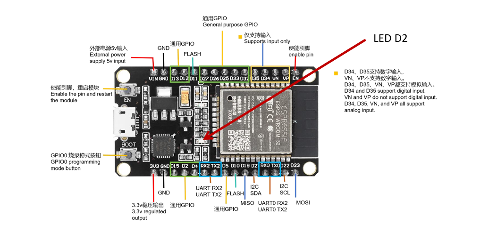
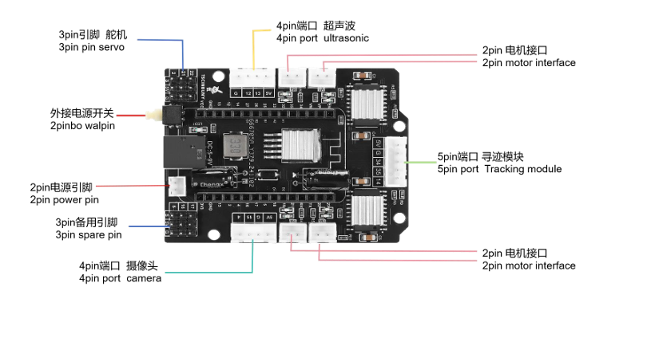
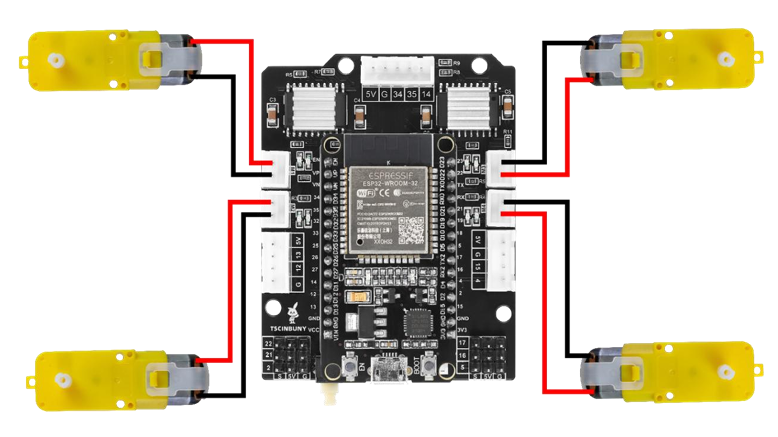
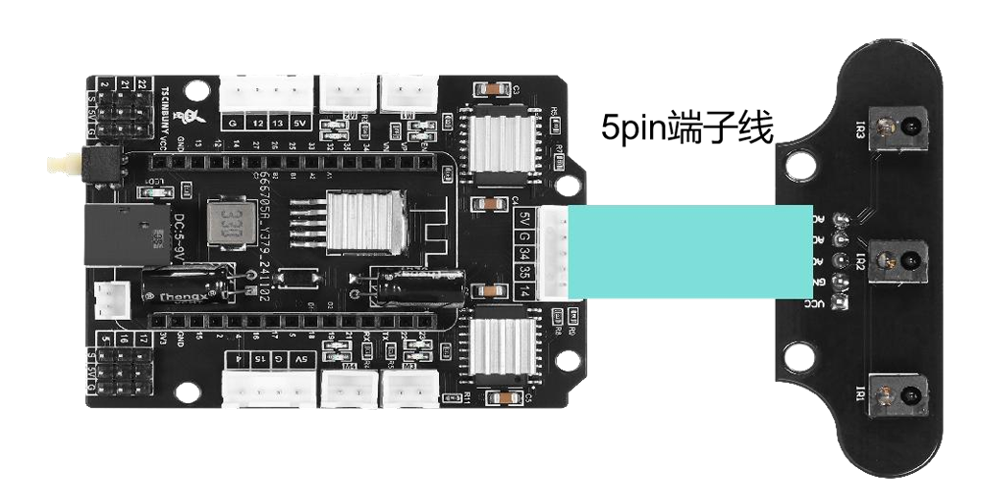
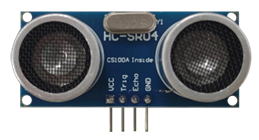
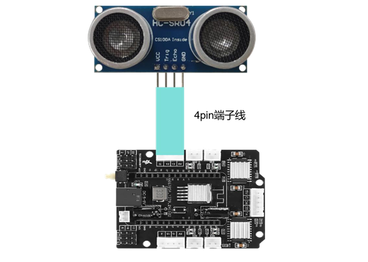
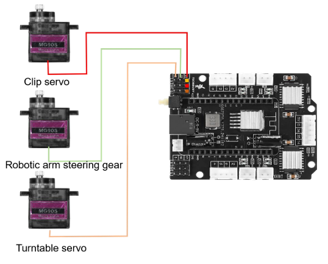

# Kit de voiture robotique ZYC0210 — MicroPython

Guide complet en français et librairie MicroPython libres pour programmer et
prendre le contrôle total du kit de voiture robotique **ZYC0210** (base
**ESP32**) : moteurs DC, capteur ultrason, module suiveur de ligne
infrarouge, bras robotisé à 3 servomoteurs, et contrôle à distance depuis un
navigateur web.

Ce dépôt est publié sous licence [MIT](LICENSE) : vous êtes libres de
l'utiliser, le modifier et le redistribuer, y compris à des fins
commerciales.

## Sommaire

- [Présentation](#présentation)
- [Matériel nécessaire](#matériel-nécessaire)
- [Les composants du kit](#les-composants-du-kit)
  - [Carte de contrôle ESP32](#carte-de-contrôle-esp32)
  - [Carte d'extension](#carte-dextension)
  - [Moteurs DC](#moteurs-dc)
  - [Module suiveur de ligne infrarouge](#module-suiveur-de-ligne-infrarouge)
  - [Capteur ultrason HC-SR04](#capteur-ultrason-hc-sr04)
  - [Servomoteurs du bras](#servomoteurs-du-bras)
- [Récapitulatif du brochage](#récapitulatif-du-brochage)
- [Installation](#installation)
  - [1. Flasher MicroPython sur l'ESP32](#1-flasher-micropython-sur-lesp32)
  - [2. Déposer la librairie sur la carte](#2-déposer-la-librairie-sur-la-carte)
  - [3. Premier test](#3-premier-test)
- [Structure du dépôt](#structure-du-dépôt)
- [Utiliser la librairie `zyc0210`](#utiliser-la-librairie-zyc0210)
- [Exemples fournis](#exemples-fournis)
- [Contrôle à distance depuis un navigateur](#contrôle-à-distance-depuis-un-navigateur)
- [Calibrer le suivi de ligne](#calibrer-le-suivi-de-ligne)
- [Dépannage](#dépannage)
- [Pour aller plus loin](#pour-aller-plus-loin)
- [Licence](#licence)

## Présentation

Le kit ZYC0210 est un châssis de voiture robotique 4 roues motrices,
équipé d'une carte ESP32, d'un bras robotisé à pince, d'un capteur de
distance à ultrason et d'un module de suivi de ligne. Ce dépôt fournit :

- une **librairie MicroPython** (`lib/`) prête à l'emploi pour piloter tous
  les composants du kit ;
- des **exemples commentés** (`exemples/`) pour tester chaque composant
  individuellement puis construire des comportements autonomes (évitement
  d'obstacles, suivi de personne, suivi de ligne, bras robotisé) ;
- un **mini serveur web** pour contrôler la voiture depuis un téléphone ou
  un ordinateur, sans installer d'application ;
- une **documentation illustrée** de chaque composant et de son brochage.

Aucune connaissance préalable de l'ESP32 ou de MicroPython n'est requise
pour suivre ce guide.

## Matériel nécessaire

- Le kit de voiture ZYC0210 assemblé (châssis, 4 moteurs DC, carte ESP32,
  carte d'extension, module ultrason HC-SR04, module suiveur de ligne
  infrarouge, 3 servomoteurs type MG90S avec bras et pince).
- Un câble USB (data, pas seulement charge) pour relier l'ESP32 à un
  ordinateur.
- Un ordinateur avec [Thonny](https://thonny.org/) (éditeur Python le plus
  simple pour démarrer avec MicroPython) ou tout autre outil compatible
  (`ampy`, `mpremote`, `rshell`...).
- Une alimentation pour les moteurs (piles/batterie du kit) — l'USB seul
  n'alimente pas les moteurs.

## Les composants du kit

### Carte de contrôle ESP32



La carte ESP32 (variante DEVKIT) est le cerveau de la voiture. Elle :

- exécute le programme MicroPython ;
- lit les capteurs (ultrason, infrarouge) ;
- commande les actionneurs (moteurs DC, servomoteurs) ;
- peut communiquer en Wi-Fi (utilisé ici pour le contrôle à distance) et en
  Bluetooth.

### Carte d'extension



La carte d'extension se fixe sur l'ESP32 et simplifie tout le câblage : elle
distribue l'alimentation (5 V et 3,3 V) et expose des connecteurs prêts à
l'emploi pour les moteurs, le module ultrason, le module suiveur de ligne et
les servomoteurs. Elle intègre également les circuits **L293D** qui pilotent
réellement les 4 moteurs DC (l'ESP32 ne peut pas fournir directement le
courant nécessaire à des moteurs).

### Moteurs DC



Le kit comporte 4 moteurs DC couplés à des roues. Chaque moteur est piloté
par **deux broches numériques** de l'ESP32 : une pour le sens avant, une
pour le sens arrière.

| Broche avance | Broche recul | Comportement du moteur    |
| :-----------: | :-----------: | -------------------------- |
| 1             | 0             | Rotation vers l'avant       |
| 0             | 1             | Rotation vers l'arrière     |
| 0             | 0             | Moteur arrêté               |
| 1             | 1             | État interdit (à éviter)    |

| Moteur           | Broche avance | Broche recul |
| ---------------- | :------------: | :------------: |
| Avant droit       | GPIO 27        | GPIO 23        |
| Arrière droit     | GPIO 33        | GPIO 32        |
| Avant gauche      | GPIO 18        | GPIO 19        |
| Arrière gauche    | GPIO 26        | GPIO 25        |

### Module suiveur de ligne infrarouge



Ce module utilise 3 capteurs infrarouges pour distinguer une surface claire
d'une ligne noire : au-dessus d'une surface claire la valeur analogique lue
est basse, au-dessus d'une ligne noire elle augmente nettement. Le seuil
exact dépend de l'éclairage et de la couleur du sol : voir
[Calibrer le suivi de ligne](#calibrer-le-suivi-de-ligne).

| Capteur infrarouge | Broche utilisée |
| ------------------- | :--------------: |
| Gauche               | GPIO 34          |
| Central              | GPIO 35          |
| Droit                | GPIO 14          |

### Capteur ultrason HC-SR04




Le module HC-SR04 mesure une distance en envoyant une impulsion ultrasonore
(broche *trigger*) et en mesurant le temps de retour de l'écho (broche
*echo*). Portée utile : environ 2 cm à 4 m.

| Module ultrason | Broche utilisée |
| ---------------- | :--------------: |
| Trigger           | GPIO 13          |
| Echo              | GPIO 12          |

### Servomoteurs du bras



Le kit inclut 3 servomoteurs (MG90S) qui forment le bras robotisé :

- **Servomoteur de la pince** (*clip servo*) : ouvre et ferme la pince pour
  saisir ou relâcher un objet.
- **Servomoteur du bras** (*robotic arm steering gear*) : lève ou abaisse
  le bras pour positionner la pince.
- **Servomoteur de la base** (*turntable servo*) : fait pivoter la base du
  bras pour orienter la pince à gauche ou à droite.

| Servomoteur | Broche utilisée |
| ----------- | :--------------: |
| Pince       | GPIO 22          |
| Bras        | GPIO 21          |
| Base        | GPIO 2           |

## Récapitulatif du brochage

| Fonction                | Broche(s) ESP32 |
| ------------------------ | ---------------- |
| Moteur avant droit        | GPIO 27 (avance) / GPIO 23 (recul) |
| Moteur arrière droit      | GPIO 33 (avance) / GPIO 32 (recul) |
| Moteur avant gauche       | GPIO 18 (avance) / GPIO 19 (recul) |
| Moteur arrière gauche     | GPIO 26 (avance) / GPIO 25 (recul) |
| Ultrason (trigger / echo) | GPIO 13 / GPIO 12 |
| Suivi de ligne (G / C / D)| GPIO 34 / GPIO 35 / GPIO 14 |
| Servo pince               | GPIO 22 |
| Servo bras                | GPIO 21 |
| Servo base                 | GPIO 2 |

## Installation

### 1. Flasher MicroPython sur l'ESP32

Si la carte ne dispose pas encore du firmware MicroPython :

1. Téléchargez le firmware générique ESP32 sur
   [micropython.org/download/ESP32_GENERIC](https://micropython.org/download/ESP32_GENERIC/).
2. Installez `esptool` :

   ```bash
   pip install esptool
   ```

3. Effacez la mémoire flash puis installez le firmware (remplacez `COM5` /
   `/dev/ttyUSB0` par le port série de votre carte) :

   ```bash
   esptool.py --port COM5 erase_flash
   esptool.py --port COM5 --baud 460800 write_flash 0x1000 firmware.bin
   ```

### 2. Déposer la librairie sur la carte

Avec [Thonny](https://thonny.org/) (menu *Exécuter > Configurer
l'interpréteur* > *MicroPython (ESP32)*), ouvrez chaque fichier du dossier
[`lib/`](lib/) et enregistrez-le **sur la carte** (*Fichier > Enregistrer
sous > MicroPython device*) en conservant son nom :

- `lib/servo.py`
- `lib/hcsr04.py`
- `lib/zyc0210.py`

Ces trois fichiers doivent se trouver à la racine du système de fichiers de
l'ESP32 (mêmes noms, sans dossier `lib` sur la carte elle-même) pour que les
`import` fonctionnent tels quels dans les exemples.

Vous pouvez aussi utiliser [`mpremote`](https://docs.micropython.org/en/latest/reference/mpremote.html) :

```bash
mpremote connect COM5 fs cp lib/servo.py :servo.py
mpremote connect COM5 fs cp lib/hcsr04.py :hcsr04.py
mpremote connect COM5 fs cp lib/zyc0210.py :zyc0210.py
```

### 3. Premier test

Copiez un exemple simple, par exemple
[`exemples/02_test_ultrason.py`](exemples/02_test_ultrason.py), sur la carte
sous le nom `main.py` (ou exécutez-le directement depuis Thonny sans le
copier) pour vérifier que tout fonctionne :

```bash
mpremote connect COM5 fs cp exemples/02_test_ultrason.py :main.py
mpremote connect COM5 reset
```

## Structure du dépôt

```
kit-voiture-zyc0210/
├── LICENSE                        # Licence MIT
├── README.md                      # Ce guide
├── images/                        # Photos et schémas des composants
├── lib/                           # Librairie MicroPython à copier sur l'ESP32
│   ├── servo.py                   # Pilotage générique d'un servomoteur (PWM)
│   ├── hcsr04.py                  # Driver du capteur ultrason HC-SR04
│   └── zyc0210.py                 # API haut niveau : moteurs, bras, comportements
└── exemples/
    ├── main.py                        # Démo : avance, recule, prise d'objet
    ├── 01_test_moteurs_dc.py          # Test brut des 4 moteurs (sans lib)
    ├── 02_test_ultrason.py            # Lecture de la distance en continu
    ├── 03_test_servomoteurs.py        # Positionnement des 3 servomoteurs
    ├── 04_test_capteurs_ligne.py      # Lecture brute des capteurs IR (calibration)
    ├── 05_suivi_ligne.py              # Suivi de ligne autonome
    ├── 06_evitement_obstacles.py      # Évitement d'obstacles autonome
    ├── 07_suivi_personne.py           # Suivi de personne/objet autonome
    ├── 08_bras_robotise.py            # Séquence de prise d'objet
    └── controle_web/
        ├── serveur_web.py             # Point d'accès Wi-Fi + serveur HTTP
        └── index.html                 # Page de contrôle (boutons directionnels)
```

## Utiliser la librairie `zyc0210`

Une fois `lib/servo.py`, `lib/hcsr04.py` et `lib/zyc0210.py` copiés sur la
carte, toutes les fonctions suivantes sont disponibles via
`from zyc0210 import ...` :

| Fonction | Description |
| -------- | ------------ |
| `moveForward()` | Avance en ligne droite |
| `moveBackward()` | Recule en ligne droite |
| `rotateLeft()` | Pivote sur place vers la gauche |
| `rotateRight()` | Pivote sur place vers la droite |
| `stopMoving()` | Coupe les 4 moteurs |
| `getDistance()` | Distance mesurée par l'ultrason, en mm |
| `initServo()` | Replace le bras et la pince en position de repos |
| `takeObject()` | Séquence complète de prise d'un objet |
| `obstacleAvoidance()` | Comportement autonome : évite les obstacles (boucle infinie) |
| `followMe()` | Comportement autonome : suit une personne/un objet (boucle infinie) |
| `lineTracking()` | Un pas de suivi de ligne (à appeler en boucle) |

Exemple minimal :

```python
from zyc0210 import moveForward, stopMoving
import time

moveForward()
time.sleep(1)
stopMoving()
```

## Exemples fournis

Le dossier [`exemples/`](exemples/) est numéroté pour suivre une
progression pédagogique, du test unitaire de chaque composant jusqu'aux
comportements autonomes complets :

1. **`01_test_moteurs_dc.py`** — teste directement le câblage des 4 moteurs
   (n'utilise pas la librairie, utile pour un premier diagnostic matériel).
2. **`02_test_ultrason.py`** — affiche la distance mesurée en continu.
3. **`03_test_servomoteurs.py`** — positionne les 3 servomoteurs à des
   angles de référence.
4. **`04_test_capteurs_ligne.py`** — affiche les valeurs brutes des 3
   capteurs infrarouges (pour calibrer le suivi de ligne).
5. **`05_suivi_ligne.py`** — suivi de ligne noire en continu.
6. **`06_evitement_obstacles.py`** — évitement d'obstacles autonome.
7. **`07_suivi_personne.py`** — suivi de personne/objet autonome.
8. **`08_bras_robotise.py`** — démonstration du bras robotisé.
9. **`controle_web/`** — contrôle manuel à distance depuis un navigateur
   (voir section suivante).
10. **`main.py`** — petite démo qui enchaîne avance / recule / prise
    d'objet, à copier sous le nom `main.py` sur la carte pour un lancement
    automatique au démarrage.

Pour exécuter un exemple, copiez-le sur la carte (avec Thonny ou
`mpremote fs cp`) sous le nom `main.py`, ou exécutez-le directement depuis
Thonny sans le renommer.

## Contrôle à distance depuis un navigateur

Le dossier [`exemples/controle_web/`](exemples/controle_web/) transforme la
voiture en petit serveur web autonome, contrôlable depuis n'importe quel
téléphone ou ordinateur, sans application à installer.

1. Copiez **les deux fichiers** `serveur_web.py` et `index.html` sur la
   carte, dans le même dossier (racine du système de fichiers) :

   ```bash
   mpremote connect COM5 fs cp exemples/controle_web/index.html :index.html
   mpremote connect COM5 fs cp exemples/controle_web/serveur_web.py :main.py
   mpremote connect COM5 reset
   ```

2. Au démarrage, l'ESP32 crée un point d'accès Wi-Fi nommé
   **`voiture-robot`** (mot de passe `voiture1234`).
3. Connectez votre téléphone ou ordinateur à ce réseau Wi-Fi.
4. Ouvrez un navigateur à l'adresse **`http://192.168.4.1`**.
5. Utilisez les boutons directionnels et le bouton stop pour piloter la
   voiture en temps réel.

Vous pouvez modifier le nom du réseau, le mot de passe, ou le contenu de la
page dans ces deux fichiers librement.

## Calibrer le suivi de ligne

Le seuil utilisé pour distinguer la ligne noire du sol (`BlackLine` dans
`lib/zyc0210.py`, fixé par défaut à `600`) dépend fortement de l'éclairage
ambiant et de la couleur exacte du sol et de la ligne :

1. Exécutez [`exemples/04_test_capteurs_ligne.py`](exemples/04_test_capteurs_ligne.py)
   et observez les valeurs affichées dans la console.
2. Placez chaque capteur au-dessus du sol clair : notez les valeurs
   (typiquement basses).
3. Placez chaque capteur au-dessus de la ligne noire : notez les valeurs
   (nettement plus hautes).
4. Choisissez une valeur de seuil `BlackLine` intermédiaire entre les deux,
   puis modifiez-la dans `lib/zyc0210.py`.
5. Relancez [`exemples/05_suivi_ligne.py`](exemples/05_suivi_ligne.py) pour
   vérifier le résultat.

## Dépannage

- **`OSError: Out of range` avec le capteur ultrason** : aucun écho reçu
  dans le délai imparti (portée dépassée, capteur mal branché, ou rien en
  face du capteur). Vérifiez le câblage trigger/echo et la présence d'un
  obstacle à moins de 4 m.
- **Un moteur tourne dans le mauvais sens** : inversez les deux fils du
  moteur concerné, ou inversez les deux broches correspondantes dans le
  code (avance ↔ recul).
- **Un moteur ne tourne pas du tout** : vérifiez l'alimentation dédiée aux
  moteurs (l'alimentation USB de programmation ne suffit pas) et le
  connecteur sur la carte d'extension.
- **Les servomoteurs tremblent ou dérivent** : vérifiez qu'ils sont bien
  alimentés en 5 V (pas seulement en 3,3 V) et que le fil de signal est
  bien sur la broche attendue.
- **Le suivi de ligne est erratique** : le seuil `BlackLine` n'est pas
  adapté à votre sol/éclairage — voir [Calibrer le suivi de ligne](#calibrer-le-suivi-de-ligne).
- **Impossible d'importer `zyc0210`, `servo` ou `hcsr04`** : ces fichiers
  doivent être copiés sur la carte elle-même (pas seulement présents dans
  ce dépôt sur votre ordinateur) — voir
  [Déposer la librairie sur la carte](#2-déposer-la-librairie-sur-la-carte).

## Pour aller plus loin

Quelques pistes pour prolonger ce projet :

- **Variation de vitesse par PWM** : remplacer les sorties tout-ou-rien des
  moteurs par des signaux PWM pour contrôler la vitesse, pas seulement le
  sens de rotation.
- **Combiner suivi de ligne et évitement d'obstacles** : interrompre
  temporairement le suivi de ligne si un obstacle est détecté par
  l'ultrason.
- **Pilotage par Bluetooth** : utiliser le Bluetooth de l'ESP32 pour un
  contrôle manuel depuis un téléphone, en complément (ou remplacement) du
  contrôle Wi-Fi.
- **Enregistrement de trajectoires** : mémoriser une séquence de
  déplacements pour la rejouer automatiquement.
- **Vision par caméra** : la carte d'extension expose un connecteur 4 broches
  prévu pour une caméra, non exploité dans ce dépôt.

## Licence

Ce projet est distribué sous licence [MIT](LICENSE). Vous pouvez l'utiliser,
le copier, le modifier et le redistribuer librement, y compris à des fins
commerciales, à condition de conserver la mention de licence.
